# Sean Lahman Baseball - Society for American Baseball Research (SABR)


## Tools & Technologies

Advanced MySQL techniques, including:

- Window Functions
- Subqueries
- Common Table Expressions (CTEs)
- Complex aggregations
- Joins & Unions
- Moving averages & rolling cumulative sums

## Dataset Overview

[**Original dataset available here**](https://sabr.org/lahman-database/)

This dataset contains thousands of Major League Baseball (MLB) player records dating back to the 1870s, sourced from the **Society for American Baseball Research (SABR)**.

## Data Structure & Challenges

The dataset consists of four primary tables:

- `players`
- `salaries`
- `schools`
- `school_details`

**Key observations:**

- Tables are linked via consistent `playerID` values, enabling efficient joins.
- Data inconsistencies exist, such as:
  - Duplicates & whitespace issues
  - Varying data types
  - Date fields requiring concatenation
  - Spread-out data across tables (e.g., player, salary, and team information)

## Project Objectives

The goal is to leverage SQL for data cleaning, optimization, and in-depth analysis of MLB teams. The project is divided into four key sections:

1. **School Analysis:** Which schools produce MLB players?
2. **Salary Analysis:** How do teams allocate player salaries?
3. **Career Analysis:** What are the career trajectories of MLB players?
4. **Player Attributes:** How do players compare in terms of physical characteristics and performance?

Each section provides a detailed breakdown, offering insights into players and teams.

## Methodology

> **Note:** Detailed SQL queries with comments are provided within the corresponding `.sql` file.

---

## 🏫 PART 1 - _School Analysis_

### ⭐ Schools Producing MLB Players per Decade

```
WITH schools AS (SELECT		s.playerID, s.schoolID, s.yearID
							FROM schools s
							LEFT JOIN school_details sd
							ON s.schoolID = sd.schoolID),

	 numSchools AS (SELECT	COUNT(playerID) AS numPlayers,
							ROUND(yearID, -1) AS decade,
							COUNT(DISTINCT schoolID) AS numSchools
							FROM schools
							GROUP BY decade)
	 SELECT *
	 FROM numSchools
	 ORDER BY decade;
```

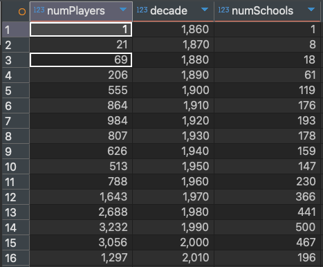

### 🏆 Top 5 Schools Producing the Most Players

```
SELECT 	sd.name_full, COUNT(DISTINCT playerID) AS totalPlayers
FROM 	schools s
		LEFT JOIN school_details sd
		ON s.schoolID = sd.schoolID
GROUP BY sd.name_full
ORDER BY totalPlayers DESC
LIMIT 5;
```


### 🌎 Top 3 Schools per decade Producing MLB Players

```
WITH ds AS 	(SELECT ROUND(s.yearID, -1) AS decade, sd.name_full, COUNT(DISTINCT playerID) AS totalPlayers
			FROM 	schools s
					LEFT JOIN school_details sd
					ON s.schoolID = sd.schoolID
			GROUP BY decade, sd.schoolID),

	rn 	AS	(SELECT 	decade, name_full, totalPlayers,
						ROW_NUMBER() OVER(PARTITION BY decade ORDER BY totalPlayers DESC ) AS row_num
						FROM ds)

SELECT decade, name_full, totalPLayers FROM rn
WHERE 	row_num <= 3
ORDER BY decade DESC, row_num;
```

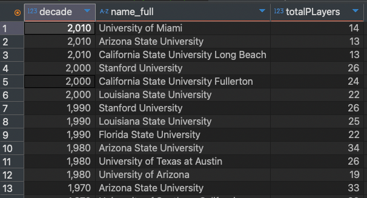

## 💰 PART 2 - _Salary Analysis_

### 💵 Top 20% of Teams by Average Annual Spending

```
WITH total_spend AS (SELECT yearID, teamID, SUM(salary) AS total_spend
					FROM salaries
					GROUP BY teamID, yearID
					ORDER BY teamID, yearID),

	spend_pct AS 	(SELECT teamID, AVG(total_spend) AS avg_spend,
					NTILE(5) OVER(ORDER BY AVG(total_spend) DESC ) AS spend_pct
					FROM total_spend
					GROUP BY teamID)

SELECT 	teamID, ROUND(avg_spend / 1000000) AS total_in_mil
FROM 	spend_pct
WHERE spend_pct = 1;
```

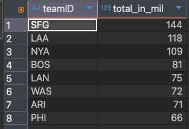

### 💰 Cumulative sum of spending over the years for each team

```
WITH ts AS (SELECT   teamID, yearID, SUM(salary) AS total_spend
			FROM 	 salaries
			GROUP BY teamID, yearID
			ORDER BY teamID, yearID)

SELECT 	*,
		ROUND(SUM(total_spend) OVER(PARTITION BY teamID ORDER BY yearID)/1000000, 1) AS cumalative_sum_millions
FROM 	ts;
```

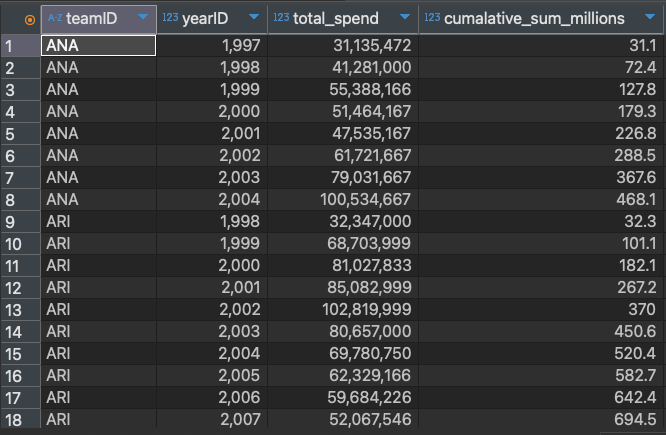

### 💰 First year that each team's cumulative spending surpassed 1 billion

```
WITH ts AS (SELECT   teamID, yearID, SUM(salary) AS total_spend
			FROM 	 salaries
			GROUP BY teamID, yearID
			ORDER BY teamID, yearID),

	 cs AS (SELECT 	*,
			SUM(total_spend) OVER(PARTITION BY teamID ORDER BY yearID) AS cumalative_sum
			FROM 	ts),

	 rn AS (SELECT 	teamID, yearID, cumalative_sum,
			ROW_NUMBER() OVER(PARTITION BY teamID ORDER BY cumalative_sum ) AS rn
			FROM 	cs
			WHERE cumalative_sum > 1000000000)

SELECT 	teamID, yearID, ROUND(cumalative_sum / 1000000000, 2) AS cumulative_sum_billions
FROM  	rn
WHERE rn = 1;
```

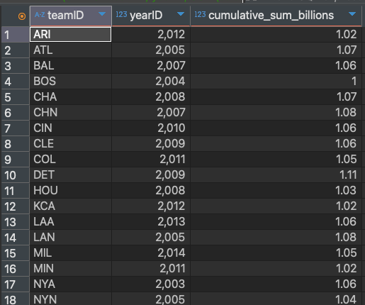

## 🏆 PART 3 - _Career Analysis_

### 📅 Player career start, end, and career length

```
WITH careerYears AS (SELECT DISTINCT nameGiven, debut, finalGame,
					CAST(CONCAT(birthYear, '-', birthMonth, '-', birthDay) AS DATE)  AS birthDate
					FROM players)

SELECT 	*,
		TIMESTAMPDIFF(YEAR, birthDate, debut) AS starting_age,
		TIMESTAMPDIFF(YEAR, birthDate, finalGame ) AS ending_age,
		TIMESTAMPDIFF(YEAR, debut, finalGame ) AS career_length
FROM 	careerYears;
```

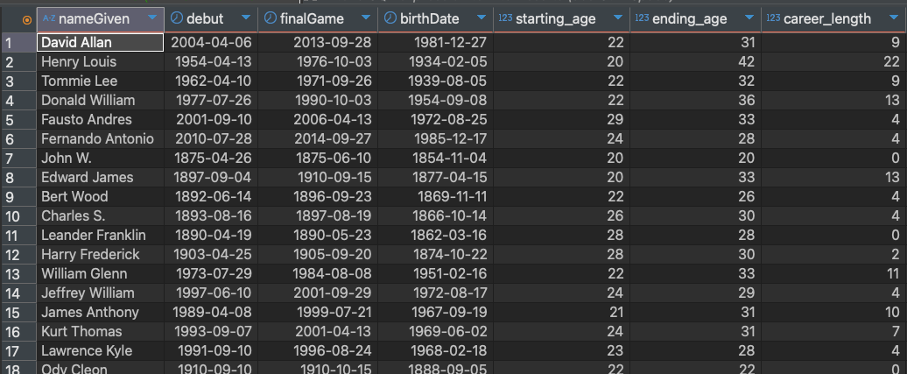

### 📈 Teams played in during start and end of career

```
SELECT  p.nameGiven,
		s.yearID AS startingYear, s.teamID AS startingTeam, e.yearID AS endingYear, e.teamID AS endingTeam
FROM 	players p
		INNER JOIN salaries s
				ON p.playerID = s.playerID
				AND YEAR(p.debut) = s.yearID
		INNER JOIN salaries e
				ON p.playerID = e.playerID
				AND YEAR(p.finalGame) = e.yearID;
```

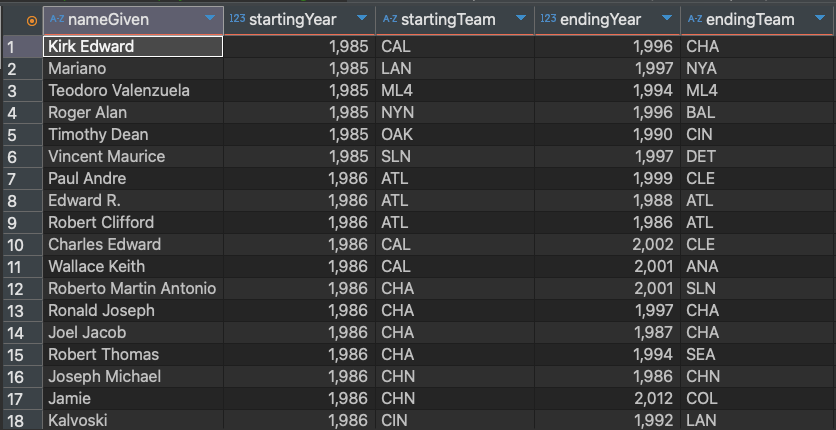

### :star: Players who started and ended their career, in the same team, and over 10 years.

```
SELECT  p.nameGiven,
		s.yearID AS startingYear, s.teamID AS startingTeam, e.yearID AS endingYear, e.teamID AS endingTeam
FROM 	players p
		INNER JOIN salaries s
				ON p.playerID = s.playerID
				AND YEAR(p.debut) = s.yearID
		INNER JOIN salaries e
				ON p.playerID = e.playerID
				AND YEAR(p.finalGame) = e.yearID
WHERE 	s.teamID = e.teamID AND e.yearID - s.yearID > 10;
```

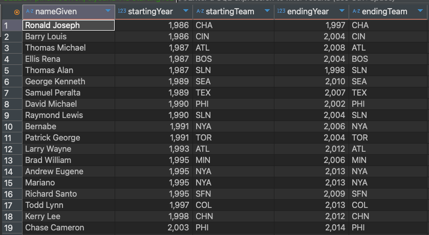

## 🏋️‍♂️ PART 4 - _Player Attribute Analysis_

### 🎂 Players with the same birthdate

```
WITH bn AS (SELECT 	nameGiven, CAST(CONCAT(birthYear, '-', birthMonth, '-', birthDay) AS DATE) AS birthDate
			FROM 	players)

SELECT 	birthDate,
		GROUP_CONCAT(nameGiven SEPARATOR ', ') AS players,
		COUNT(nameGiven) AS numPlayers
FROM 	bn
WHERE 	birthDate IS NOT NULL AND YEAR(birthDate) BETWEEN 1980 AND 1990
GROUP BY birthDate
HAVING COUNT(nameGIven) >= 2
ORDER BY birthDate DESC;
```

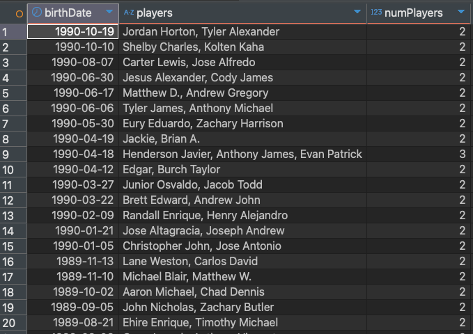

### :star: Percentage of players who bat with their left, right or both hands per team.

```
SELECT p.nameGiven, s.teamID, p.bats
FROM 	players p
		INNER JOIN salaries s
		ON p.playerID = s.playerID;

WITH bat AS (SELECT p.playerID, s.teamID, p.bats
		 FROM 	players p
		 		INNER JOIN salaries s
				ON p.playerID = s.playerID)
```

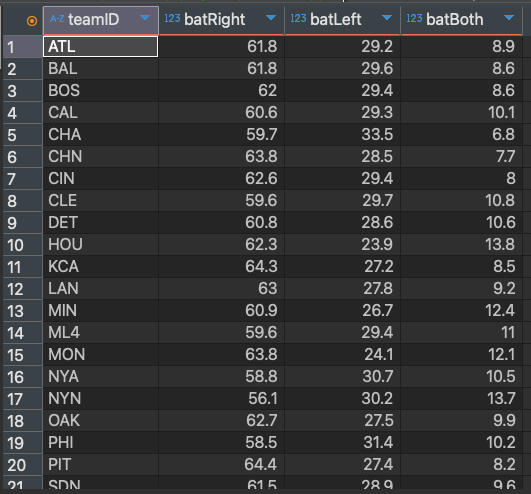

### 📏 Average player height & weight per decade

```
WITH hw AS (SELECT  AVG(height) AS avgHeight,
					AVG(weight) AS avgWeight,
					ROUND(YEAR(debut), -1) AS decade
					FROM 	players
					GROUP BY decade)

SELECT 	decade,
		ROUND(avgHeight - LAG(avgHeight) OVER(ORDER BY decade), 3) AS heightDiff,
		ROUND(avgWeight - LAG(avgWeight) OVER(ORDER BY decade), 3) AS weightDiff
FROM 	hw
WHERE decade IS NOT null;
```

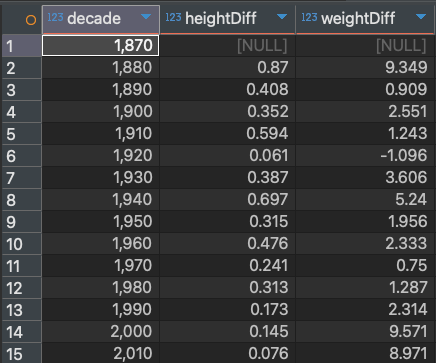

## 🔍 Insights Conclusion

#### :zap: Schools Producing MLB Players:-
- There was a significant jump from 1900 > 1910 with 70 schools producing 300 more players.
- From 1910 to 1970 we can see consistent peaks and troughs with schools taking on more players.
- From 1970 there was a significant peak over 855 players in over 85 additional schools
- This was followed by consistent growth into the early 2000's

#### :zap: Top 5 Schools Producing the Most Players (Overall):-
- University of Texas at Austin - `107 players`
- University of Southern California - `105 players`
- Arizona State University - `101 players`
- Stanford University - `86 players`
- University of Michigan - `76 players`

:zap: For each decade, what were the top 3 schools:-
#### :calendar: Decade 2010

- Miami University
- Arizona State University
- California State University

#### :calendar: Decade 2000

- Stanford University
- California State University
- Louisiana State University

#### :calendar: Decade 1990

- Stanford University
- Louisiana State University
- Florida State University

#### :calendar: Decade 1980:-
- Arizona University
- Arizona State University
- Texas State University

As you can see, from the 1970s+ the following universities remained the top 3 for at least two decades (consecutively).

- Arizona State
- Louisiana State
- California State

#### :zap: Top 20% of Teams by Average Annual Spending:-
- SFG – University of San Francisco - `144 Million`
- LAA – University of La Verne - `118 Million`
- NYA – Likely refers to New York - `109 Million`
- BOS – Boston University - `81 Million`
- LAN – Could relate to universities - `75 Million`
- WAS – University of Washington - `72 Million`
- ARI – University of Arizona - `71 Million`
- PHI – University of Pennsylvania - `66 Million`

#### :zap: First year that each team's cumulative spending surpassed 1 billion (Descending order):-
- Milwaukee (MIL) - 2014 - 1.05 Billion
- Kansas City (KCA) - 2012 - 1.02 Billion
- Oakland (OAK) - 2012 - 1.05 Billion
- San Diego (SDN) - 2012 - 1.04 Billion
- Seattle (SEA) - 2012 - 1.04 Billion
- Colorado (COL) - 2011 - 1.05 Billion
- Minnesota (MIN) - 2011 - 1.02 Billion
- Cleveland (CLE) - 2009 - 1.06 Billion
- Detroit (DET) - 2009 - 1.1 Billion
- Philadelphia (PHI) - 2008 - 1.03 Billion
- Toronto (TOR) - 2008 - 1.05 Billion
- Houston (HOU) - 2008 - 1.03 Billion
- Chicago (CHA) - 2008 - 1.07 Billion
- Cincinnati (CIN) - 2006 - 1.06 Billion
- New York Yankees (NYA) - 2003 - 1.06 Billion
- New York Mets (NYN) - 2005 - 1.04 Billion
- Los Angeles (LAN) - 2005 - 1.08 Billion
- St. Louis (SLN) - 2007 - 1.07 Billion
- San Francisco (SFN) - 2007 - 1.07 Billion
- Texas (TEX) - 2007 - 1.04 Billion
- Chicago Cubs (CHN) - 2007 - 1.08 Billion

#### :zap: Players that remained on the same team and played for over a decade:-
- Ronald Joseph – 1986 to 1997 – Chicago White Sox (CHA)
- Barry Louis – 1986 to 2004 – Cincinnati Reds (CIN)
- Thomas Michael – 1987 to 2008 – Atlanta Braves (ATL)
- Ellis Rena – 1987 to 2004 – Boston Red Sox (BOS)
- Thomas Alan – 1987 to 1998 – St. Louis Cardinals (SLN)
- George Kenneth – 1989 to 2010 – Seattle Mariners (SEA)
- Samuel Peralta – 1989 to 2007 – Texas Rangers (TEX)
- David Michael – 1990 to 2002 – Philadelphia Phillies (PHI)
- Raymond Lewis – 1990 to 2004 – St. Louis Cardinals (SLN)
- Bernabe – 1991 to 2006 – New York Yankees (NYA)
- Patrick George – 1991 to 2004 – Toronto Blue Jays (TOR)
- Larry Wayne – 1993 to 2012 – Atlanta Braves (ATL)
- Brad William – 1995 to 2006 – Minnesota Twins (MIN)
- Andrew Eugene – 1995 to 2013 – New York Yankees (NYA)
- Mariano – 1995 to 2013 – New York Yankees (NYA)
- Richard Santo – 1995 to 2009 – San Francisco Giants (SFN)
- Todd Lynn – 1997 to 2013 – Colorado Rockies (COL)
- Kerry Lee – 1997 to 2002 – Chicago Cubs (CHN)
- Chase Cameron – 2003 to 2014 – Philadelphia Phillies (PHI)

#### :zap: Up to 350 players have the same birthday

#### :zap: Percentage of Players Batting Left, Right, or Both Hands by Team

| Team | Bat Right (%) | Bat Left (%) | Bat Both (%) |
|---|---|---|---|
| Atlanta Braves (ATL) | 61.8 | 29.2 | 8.9 |
| Baltimore Orioles (BAL) | 61.8 | 29.6 | 8.6 |
| Boston Red Sox (BOS) | 62 | 29.4 | 8.6 |
| California Angels (CAL) | 60.6 | 29.3 | 10.1 |
| Chicago White Sox (CHA) | 59.7 | 33.5 | 6.8 |
| Chicago Cubs (CHN) | 63.8 | 28.5 | 7.7 |
| Cincinnati Reds (CIN) | 62.6 | 29.4 | 8 |
| Cleveland Guardians (CLE) | 59.6 | 29.7 | 10.8 |
| Detroit Tigers (DET) | 60.8 | 28.6 | 10.6 |
| Houston Astros (HOU) | 62.3 | 23.9 | 13.8 |
| Kansas City Royals (KCA) | 64.3 | 27.2 | 8.5 |
| Los Angeles Angels (LAN) | 63 | 27.8 | 9.2 |
| Minnesota Twins (MIN) | 60.9 | 26.7 | 12.4 |
| Miami Marlins (MLA) | 59.6 | 29.4 | 11 |
| Montreal Expos (MON) | 63.8 | 24.1 | 12.1 |
| New York Yankees (NYA) | 58.8 | 30.7 | 10.5 |
| New York Mets (NYN) | 56.1 | 30.2 | 13.7 |
| Oakland Athletics (OAK) | 62.7 | 27.5 | 9.9 |
| Philadelphia Phillies (PHI) | 58.5 | 31.4 | 10.2 |
| Pittsburgh Pirates (PIT) | 64.4 | 27.4 | 8.2 |
| San Diego Padres (SDN) | 61.5 | 28.9 | 9.6 |
| Seattle Mariners (SEA) | 61.7 | 28.9 | 9.4 |
| San Francisco Giants (SFN) | 61.1 | 27.5 | 11.3 |
| St. Louis Cardinals (SLN) | 61.9 | 26.5 | 11.6 |
| Texas Rangers (TEX) | 63.6 | 26.4 | 9.9 |
| Toronto Blue Jays (TOR) | 64 | 26.6 | 9.4 |
| Colorado Rockies (COL) | 63.7 | 27.8 | 8.5 |
| Florida Marlins (FLO) | 66.3 | 24.3 | 9.4 |
| Anaheim Angels (ANA) | 61.1 | 31.6 | 7.3 |
| Arizona Diamondbacks (ARI) | 61.7 | 30.4 | 7.9 |
| Milwaukee Brewers (MIL) | 66.4 | 29.4 | 4.2 |
| Tampa Bay Rays (TBA) | 59.8 | 31 | 9.2 |
| Los Angeles Angels (LAA) | 68.2 | 16.6 | 15.2 |
| Washington Nationals (WAS) | 62.8 | 25.5 | 11.7 |
| Miami Marlins (MIA) | 64.9 | 29.9 | 5.2 | 

- Right-Handed Dominance: The vast majority of players in nearly all teams bat right-handed. This reflects the natural population distribution where right-handedness is more common.

- Left-Handed Consistency: The percentage of left-handed batters tends to be fairly consistent across teams, generally hovering around the 25-30% range.

- Switch-Hitting Rarity: The percentage of switch-hitters (batting with both hands) is relatively low across all teams, typically below 15%. This suggests that switch-hitting is a less common skill.

#### :zap: Average Height and Weight Differences Per Decade

| Decade | Average Height Difference (Inches) | Average Weight Difference (Pounds) |
|---|---|---|
| 1880 | 0.87 | 9.349 |
| 1890 | 0.408 | 0.909 |
| 1900 | 0.352 | 2.551 |
| 1910 | 0.594 | 1.243 |
| 1920 | 0.061 | -1.096 |
| 1930 | 0.387 | 3.606 |
| 1940 | 0.697 | 5.24 |
| 1950 | 0.315 | 1.956 |
| 1960 | 0.476 | 2.333 |
| 1970 | 0.241 | 0.75 |
| 1980 | 0.313 | 1.287 |
| 1990 | 0.173 | 2.314 |
| 2000 | 0.145 | 9.571 |
| 2010 | 0.076 | 8.971 |

- Height: The decreasing height differences might suggest a convergence in player heights, possibly due to improved nutrition and training methods leading to more consistent physical development.

- Weight: The fluctuating weight differences, especially the recent highs, could indicate changes in player roles, training, and potentially dietary habits (e.g., increased muscle mass). The high weight differences in the 2000s and 2010s could also reflect changes in the sport itself, such as increased emphasis on power hitting.
