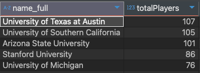

# Sean Lahman Baseball - Society for American Baseball Research (SABR)


## Tools & Technologies

Advanced MySQL techniques, including:

- Window Functions
- Subqueries
- Common Table Expressions (CTEs)
- Complex aggregations
- Joins & Unions
- Moving averages & rolling cumulative sums

## Dataset Overview

[**Original dataset available here**](https://sabr.org/lahman-database/)

This dataset contains thousands of Major League Baseball (MLB) player records dating back to the 1870s, sourced from the **Society for American Baseball Research (SABR)**.

## Data Structure & Challenges

The dataset consists of four primary tables:

- `players`
- `salaries`
- `schools`
- `school_details`

**Key observations:**

- Tables are linked via consistent `playerID` values, enabling efficient joins.
- Data inconsistencies exist, such as:
  - Duplicates & whitespace issues
  - Varying data types
  - Date fields requiring concatenation
  - Spread-out data across tables (e.g., player, salary, and team information)

## Project Objectives

The goal is to leverage SQL for data cleaning, optimization, and in-depth analysis of MLB teams. The project is divided into four key sections:

1. **School Analysis:** Which schools produce MLB players?
2. **Salary Analysis:** How do teams allocate player salaries?
3. **Career Analysis:** What are the career trajectories of MLB players?
4. **Player Attributes:** How do players compare in terms of physical characteristics and performance?

Each section provides a detailed breakdown, offering insights into players and teams.

## Methodology

> **Note:** Detailed SQL queries with comments are provided within the corresponding `.sql` file.

---

## 🏫 PART 1 - _School Analysis_

### ⭐ Schools Producing MLB Players per Decade

```
WITH schools AS (SELECT		s.playerID, s.schoolID, s.yearID
							FROM schools s
							LEFT JOIN school_details sd
							ON s.schoolID = sd.schoolID),

	 numSchools AS (SELECT	COUNT(playerID) AS numPlayers,
							ROUND(yearID, -1) AS decade,
							COUNT(DISTINCT schoolID) AS numSchools
							FROM schools
							GROUP BY decade)
	 SELECT *
	 FROM numSchools
	 ORDER BY decade;
```


### 🏆 Top 5 Schools Producing the Most Players

```
SELECT 	sd.name_full, COUNT(DISTINCT playerID) AS totalPlayers
FROM 	schools s
		LEFT JOIN school_details sd
		ON s.schoolID = sd.schoolID
GROUP BY sd.name_full
ORDER BY totalPlayers DESC
LIMIT 5;
```



### 🌎 Top 3 Schools per Country Producing MLB Players

```
WITH ds AS 	(SELECT ROUND(s.yearID, -1) AS decade, sd.name_full, COUNT(DISTINCT playerID) AS totalPlayers
			FROM 	schools s
					LEFT JOIN school_details sd
					ON s.schoolID = sd.schoolID
			GROUP BY decade, sd.schoolID),

	rn 	AS	(SELECT 	decade, name_full, totalPlayers,
						ROW_NUMBER() OVER(PARTITION BY decade ORDER BY totalPlayers DESC ) AS row_num
						FROM ds)

SELECT decade, name_full, totalPLayers FROM rn
WHERE 	row_num <= 3
ORDER BY decade DESC, row_num;
```


## 💰 PART 2 - _Salary Analysis_

### 💵 Top 20% of Teams by Average Annual Spending

```
WITH total_spend AS (SELECT yearID, teamID, SUM(salary) AS total_spend
					FROM salaries
					GROUP BY teamID, yearID
					ORDER BY teamID, yearID),

	spend_pct AS 	(SELECT teamID, AVG(total_spend) AS avg_spend,
					NTILE(5) OVER(ORDER BY AVG(total_spend) DESC ) AS spend_pct
					FROM total_spend
					GROUP BY teamID)

SELECT 	teamID, ROUND(avg_spend / 1000000) AS total_in_mil
FROM 	spend_pct
WHERE spend_pct = 1;
```


### 💰 Cumulative sum of spending over the years for each team

```
WITH ts AS (SELECT   teamID, yearID, SUM(salary) AS total_spend
			FROM 	 salaries
			GROUP BY teamID, yearID
			ORDER BY teamID, yearID)

SELECT 	*,
		ROUND(SUM(total_spend) OVER(PARTITION BY teamID ORDER BY yearID)/1000000, 1) AS cumalative_sum_millions
FROM 	ts;
```


### 💰 First year that each team's cumulative spending surpassed 1 billion

```
WITH ts AS (SELECT   teamID, yearID, SUM(salary) AS total_spend
			FROM 	 salaries
			GROUP BY teamID, yearID
			ORDER BY teamID, yearID),

	 cs AS (SELECT 	*,
			SUM(total_spend) OVER(PARTITION BY teamID ORDER BY yearID) AS cumalative_sum
			FROM 	ts),

	 rn AS (SELECT 	teamID, yearID, cumalative_sum,
			ROW_NUMBER() OVER(PARTITION BY teamID ORDER BY cumalative_sum ) AS rn
			FROM 	cs
			WHERE cumalative_sum > 1000000000)

SELECT 	teamID, yearID, ROUND(cumalative_sum / 1000000000, 2) AS cumulative_sum_billions
FROM  	rn
WHERE rn = 1;
```


## 🏆 PART 3 - _Career Analysis_

### 📅 Player career start, end, and career length

```
WITH careerYears AS (SELECT DISTINCT nameGiven, debut, finalGame,
					CAST(CONCAT(birthYear, '-', birthMonth, '-', birthDay) AS DATE)  AS birthDate
					FROM players)

SELECT 	*,
		TIMESTAMPDIFF(YEAR, birthDate, debut) AS starting_age,
		TIMESTAMPDIFF(YEAR, birthDate, finalGame ) AS ending_age,
		TIMESTAMPDIFF(YEAR, debut, finalGame ) AS career_length
FROM 	careerYears;
```


### 📈 Teams played in during start and end of career

```
SELECT  p.nameGiven,
		s.yearID AS startingYear, s.teamID AS startingTeam, e.yearID AS endingYear, e.teamID AS endingTeam
FROM 	players p
		INNER JOIN salaries s
				ON p.playerID = s.playerID
				AND YEAR(p.debut) = s.yearID
		INNER JOIN salaries e
				ON p.playerID = e.playerID
				AND YEAR(p.finalGame) = e.yearID;
```


### :star: Players who started and ended their career, in the same team, and over 10 years.

```
SELECT  p.nameGiven,
		s.yearID AS startingYear, s.teamID AS startingTeam, e.yearID AS endingYear, e.teamID AS endingTeam
FROM 	players p
		INNER JOIN salaries s
				ON p.playerID = s.playerID
				AND YEAR(p.debut) = s.yearID
		INNER JOIN salaries e
				ON p.playerID = e.playerID
				AND YEAR(p.finalGame) = e.yearID
WHERE 	s.teamID = e.teamID AND e.yearID - s.yearID > 10;
```


## 🏋️‍♂️ PART 4 - _Player Attribute Analysis_

### 🎂 Players with the same birthdate

```
WITH bn AS (SELECT 	nameGiven, CAST(CONCAT(birthYear, '-', birthMonth, '-', birthDay) AS DATE) AS birthDate
			FROM 	players)

SELECT 	birthDate,
		GROUP_CONCAT(nameGiven SEPARATOR ', ') AS players,
		COUNT(nameGiven) AS numPlayers
FROM 	bn
WHERE 	birthDate IS NOT NULL AND YEAR(birthDate) BETWEEN 1980 AND 1990
GROUP BY birthDate
HAVING COUNT(nameGIven) >= 2
ORDER BY birthDate DESC;
```


### :star: Percentage of players who bat with their left, right or both hands per team.

```
SELECT p.nameGiven, s.teamID, p.bats
FROM 	players p
		INNER JOIN salaries s
		ON p.playerID = s.playerID;

WITH bat AS (SELECT p.playerID, s.teamID, p.bats
		 FROM 	players p
		 		INNER JOIN salaries s
				ON p.playerID = s.playerID)
```


### 📏 Average player height & weight per decade

```
WITH hw AS (SELECT  AVG(height) AS avgHeight,
					AVG(weight) AS avgWeight,
					ROUND(YEAR(debut), -1) AS decade
					FROM 	players
					GROUP BY decade)

SELECT 	decade,
		ROUND(avgHeight - LAG(avgHeight) OVER(ORDER BY decade), 3) AS heightDiff,
		ROUND(avgWeight - LAG(avgWeight) OVER(ORDER BY decade), 3) AS weightDiff
FROM 	hw
WHERE decade IS NOT null;
```


